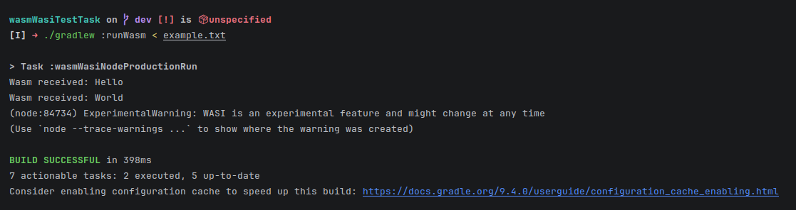

# Wasm/WASI Test Task

## Description
One have to create a Kotlin project that compiles to WebAssembly binary targeting the WASI environment.
Program should create a loop in which it reads a standard input and for every line received return it to standard 
output.

## Execution
```
./gradlew runWasm < example.txt
```
Other ways to pipe something to a standard input are supported as well.

## Screenshots



## Main roadblocks

 - While `writeln()` for Wasm/WASI already implemented, `readln()` is not yet. So I had to write my own `readln()` using
WASI call `fd_read`
   - One also can instead of rewriting `readln()` just take bytes using `fd_read` and send them to `fd_write`. I decided
to not do that because solution with `readln()` allows one to reuse this code for different future cases and maybe even
 to be contributed to a standard Kotlin library. Also, working with linear memory is unsafe, so it is advisable to move 
 to Kotlin methods instead of doing everything through WASI.
   - Reading byte-by-byte is not the most optimal solution, however it is the simplest one. However, considering that 
 `fd_pread` does not move file descriptor offset, if proper access provided, one can check with it for EOF, and then use
 a `fd_read` to read in one go. Another way is to use `fd_read` and return offset using `fd_seek`.
   - I have implemented reading in byte chunks in a `dev` branch of the repository. Unfortunately, standard input
 through standard sources like pipes or giving files as an input to Gradle tasks does not support `fd_seek`, and so 
 `readln()` function just defaults to byte by byte implementation. So the code is not applicable to this particular 
 test task, and so I have not tested it. Still, I suppose it should work even if with small fixes. I think a way to test
 it is to use `path_open()` from WASI, but it goes beyond this task. 
 - If one just makes a task which compiles `.wasm` file and then executes it, one would not be able to provide standard
input to the task. The task should be modified so Gradle provides its input to the Node.js (or other execution
environment).

## Additional details

File `stdi.kt` containing `readln()` is heavily inspired by `io.kt` kotlin package for Wasm/WASI target. Names of
variables and  methods are adhering to the names and variables in this file and error handling is managed with a help of
`WasiError.kt` file from Kotlin complier repository. It contains enum class with all possible errors which WASI can
send.